# ⚖️ Predictor of Singapore Corporate Law Appeals

[cite_start]An end-to-end data mining and deep learning pipeline designed to predict the outcome of Singapore corporate law appeals using a **Verdict-Blind Chain of Reasoning** architecture.

## 🏗 Project Architecture

Our pipeline is structured to ensure that the model learns from the **merits of the dispute** (Facts) before considering **legal arguments** 

```mermaid
graph TD
    %% Global Style
    classDef default fill:#1a1a1a,stroke:#fff,stroke-width:1px,color:#fff;
    classDef highlight fill:#2d2d2d,stroke:#f96,stroke-width:2px,color:#fff;
    classDef storage fill:#000,stroke:#fff,stroke-dasharray: 5 5;

    subgraph Acquisition [1. Data Acquisition & Ethics]
        A[Manual Judgment Retrieval]
        A1[judiciary.gov.sg / SLW]
        A2[Robots.txt Compliance Check]
    end

    subgraph Intelligence [2. Intelligence Hub - GPT-4.1]
        B{Verdict-Blind Prompting}
        B --> C[Legal Issue]
        B --> D[Rules / Citations / Statutes]
        B --> E[Disputed Facts Pattern]
        B --> F[Conclusion / Target Label]
    end

    subgraph Feature_Eng [3. Feature Representation]
        E --> G[UK-Legal SBERT Embeddings]
        D --> H[Citation Intensity Scoring]
        I[Lawyer Tenure / Case Complexity]
        J[Standard Scaling]
    end

    subgraph Modeling [4. Chain of Reasoning Model]
        K[(Structured JSON Store)]
        L[Phase 1: Learn from Facts Only]
        M[Phase 2: Integrate Citations & Metadata]
        N[Final Classifier: Deep MLP]
    end

    subgraph Validation [5. Performance & Audit]
        O[Temporal Split: 2010-22 vs 2023-24]
        P[Metrics: F1 / NDCG / Residual Analysis]
        Q[Ablation Study]
    end

    %% Connections
    A --> A2
    A2 --> B
    C & G & H & I --> J
    J --> K
    K --> L
    L --> M
    M --> N
    N --> O
    O --> P
    P --> Q

    class E,G,L highlight;
    class K storage;
```



# Judiciary Scraper

This is a Python script used to automatically scrape judgments from the Singapore Judiciary website based on specified catchwords and years. The newest update downloads the actual PDF files for the cases directly into a local folder.

## Prerequisites

- Chrome browser installed.
- Python 3.8+ installed and accessible via command line.
- Git (optional).

## Setup Instructions

1. **Open your Terminal (or Command Prompt / PowerShell)**
   Navigate to the directory containing `Scrapper.py`:
   ```bash
   cd c:\Users\temp\Documents\GitHub\BT4222-
   ```

2. **Create a Virtual Environment**
   Run the following command to create a folder named `venv` where all the required Python libraries will be isolated:
   ```bash
   # On Windows
   python -m venv venv
   # Or if 'python' isn't recognized, try:
   py -m venv venv
   ```

3. **Activate the Virtual Environment**
   Whenever you want to run the scraper or install dependencies, you must activate the virtual environment:
   ```bash
   # On Windows PowerShell
   .\venv\Scripts\Activate.ps1
   
   # On Windows Command Prompt
   .\venv\Scripts\activate
   ```
   *You'll know it's activated when you see `(venv)` at the beginning of your terminal prompt.*

4. **Install Requirements**
   Install all the required Python libraries with `pip`:
   ```bash
   pip install -r requirements.txt
   ```

## Pipeline Usage

This project is split into a **2-step pipeline**: Scraping the raw documents, and then extracting the NLP features.

### Step 1: Running the Scraper
To begin downloading cases, execute the scraper script:
```bash
python Scrapper.py
```

**Scraper Workflow:**
- The script uses `selenium` to search the `elitigation.sg` judgments portal.
- It iterates through the configured `target_years` and `target_catchwords`.
- For each case found, it immediately downloads the **PDF file** to the `Data/PDFs/` folder and runs a linguistic scan.
- **NLP Quality Control:** Only PDFs containing at least two valid corporate law keywords (e.g., "derivative action", "oppression") are kept. Irrelevant cases are automatically deleted to ensure the richness of the final dataset.

### Step 2: Extracting Machine Learning Features
Once your `Data/PDFs/` folder is populated with 100 high-quality cases, run the cleaning script:
```bash
python Clean_Data.py
```

**Extraction Workflow:**
- This script uses `pdfplumber` to analyze the raw text of every PDF in your `Data/PDFs` folder.
- It uses Regex to specifically target and extract the **CatchWords** and the **Conclusion** paragraphs (vital for determining case outcomes).
- The final processed dataset is automatically saved as `extracted_features.csv` in the `Data/Cleaned_Data/` folder, ready for your NLP model.

## Configuration
Inside `Scrapper.py`, you can change the target years and the specific domain of law you want to scrape:
```python
target_years = [str(year) for year in range(2000, 2027)][::-1]
target_catchwords = [
    "Companies — Directors — Duties"
]
# Adjust target_count=100 in the main loop to limit results
```
